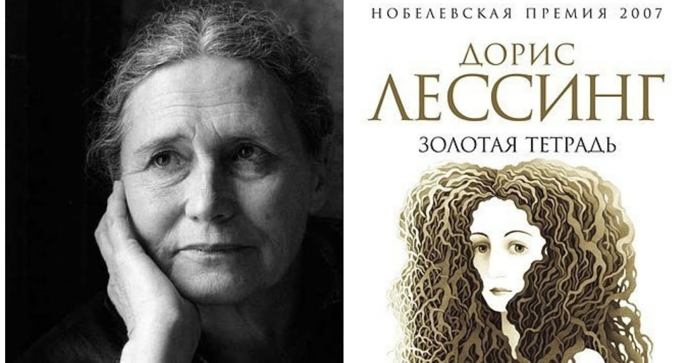
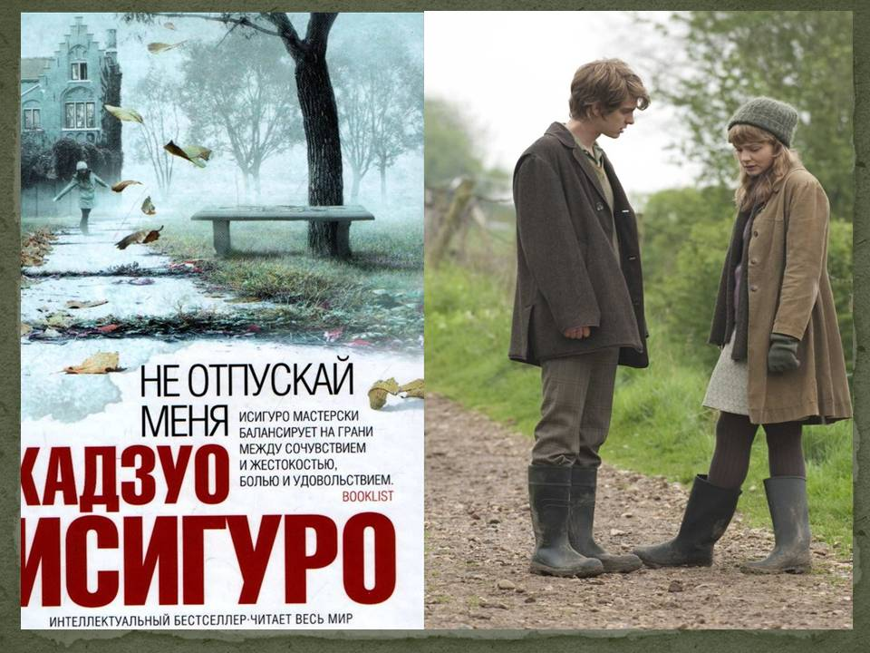
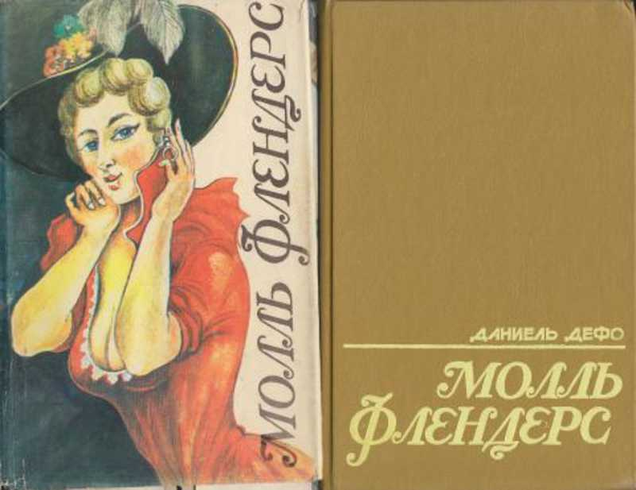
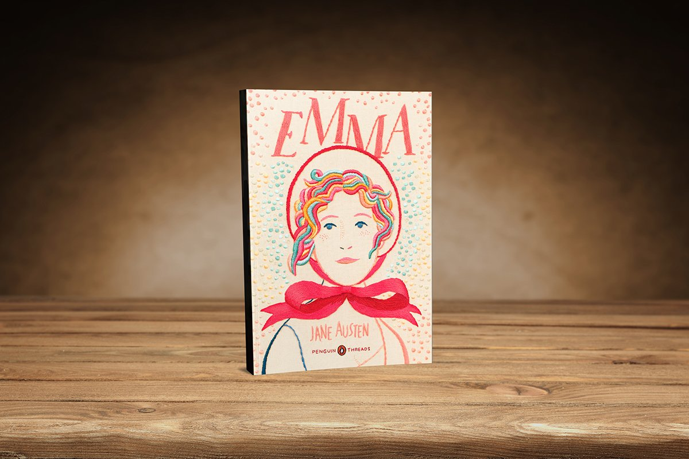
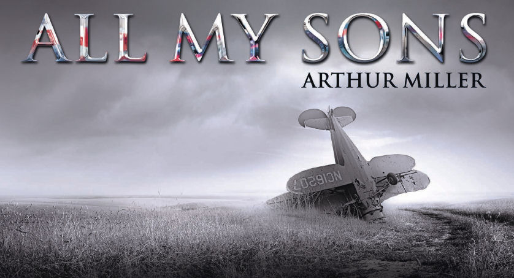

**5 книг для тех, кому понравились «Нормальные люди»**

Литература играет огромную роль в жизни Марианны и Коннелла, героев романа «Нормальные люди» Салли Руни и одноименного сериала, о которых вы наверняка слышали. Чтобы лучше понять любимых героев, рекомендуем список книг, которые нравятся Марианне и Коннеллу, – от Джейн Остин до Артура Миллера.

**«Золотая тетрадь», Дорис Лессинг**

Один из главных признаков того, что Коннелл заметно отличается от среднестатистического одержимого футболом парня, – тот факт, что он прочитал феминистскую классику Дорис Лессинг «Золотая тетрадь» по собственному желанию.  Дорис Лессинг – лауреат Нобелевской премии по литературе. Ее роман «Золотая тетрадь» был опубликован в 1962 году, он рассказывает о талантливой девушке Анне Вульф, которая записывает всю свою жизнь в четыре дневника – красный, синий, черный, желтый. Девушка рассуждает о материнстве, сексуальном освобождении, расизме, колониализме, коммунизме и психических заболеваниях, сама страдая от последних. Позже она заводит пятую тетрадь – золотую, которая помогает ей справиться с собственными проблемами. 

**«Не отпускай меня», Кадзуо Исигуро**

Оканчивая школу, Марианна читает антиутопический роман модного британского писателя японского происхождения Кадзуо Исигуры «Не отпускай меня» и, вдохновившись книгой, бунтует против того, что воспринимает как «деспотичную» школьную среду.  В 2005 году роман Исигуро попал в шорт-лист Букера, в 2010-м вышла захватывающая экранизация «Не отпускай меня» с участием Киры Найтли, Кэри Маллиган и Эндрю Гарфилда, а в 2017-м творчество писателя было отмечено Нобелевской премией по литературе.

**«Молль Флендерс», Даниель Дефо**

Какими были одни из первых жизненных уроков, которые получил Коннелл, приехав в Тринити? С одной стороны, оказалось, что многие из его сверстников способны легко судить о романах, даже не удосужившись прочитать их. С другой — самому Коннеллу было трудно высказать свое мнение о чем-либо, несмотря на то что он самый яркий ученик своего года. Именно поэтому, когда преподаватель спрашивает его, что он думает о знаменитом плутовском романе Даниеля Дефо 1722 года, повествующем о насыщенной жизни эксцентричной женщины Молль Флендерс, Коннелл говорит: «Эээ… Он довольно трогательный».

**«Эмма», Джейн Остин**

К счастью, Коннелл чувствует себя немного лучше, когда его спрашивают о еще одной яркой героине из классической английской литературы – «симпатичной, умной и богатой» Эмме Вудхаус из романа «Эмма» Джейн Остин. Эмма – самостоятельная девушка, которая не хочет жить по правилам XIX века и... любит заниматься сводничеством. Напомним, весной этого года вышла отличная экранизация романа Джейн Остин с Аней Тейлор-Джой; но книгу стоит прочесть в первую очередь.

**«Все мои сыновья», Артур Миллер**

«Все мои сыновья» – пьеса, которая принесла большой успех и премию "Тони" американскому драматургу и прозаику Артуру Миллеру. Ее сюжет основан на газетной заметке о реальном скандале, разразившемся, когда одна частная компания, будучи в сговоре с армией США, поставляла ей бракованные детали для самолетов. Эту напряженную пьесу Коннелл читает во время  путешествия в Италию.
